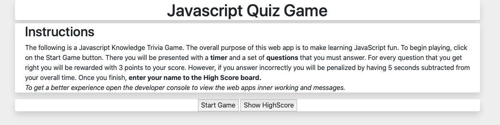
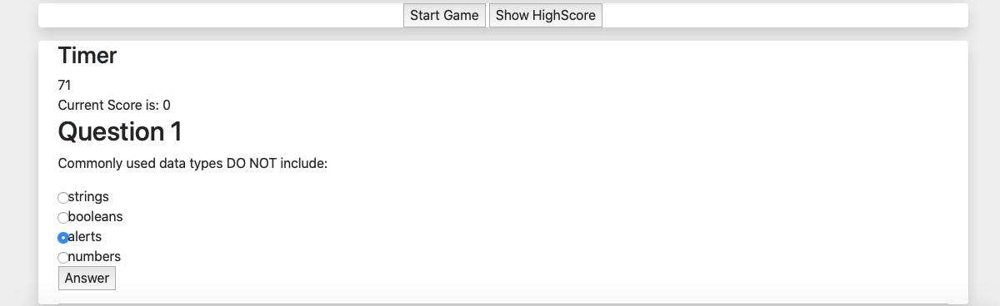
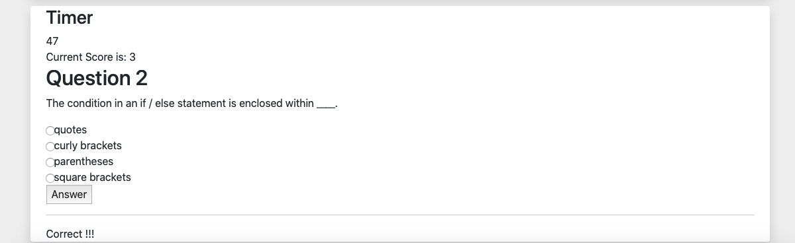
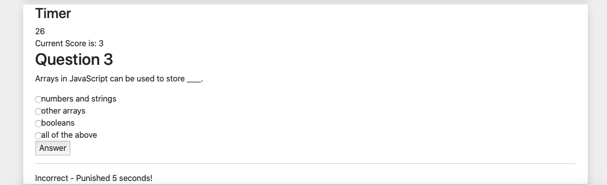
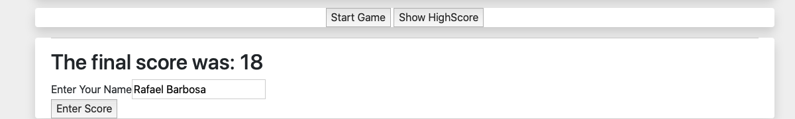
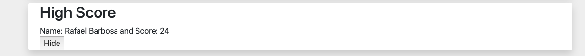

# Javascript-Code-Quiz
This repository contains the code for the JavaScript Code Quiz web app. It is a learning app designed to test your knowledge of JavaScript by quizing and providing immediate feedback on your answers. It is a gamified approach to learning.

## Table of Contents

- [Description](#description)
- [Screen Shots](#screenshots)
- [Installation](#installation)
- [Usage](#usage)
- [References](#references)
- [License](#license)

## Description
This repository provides the code for the Github Pages app for generating random passwords based on user selected criteria. This is a parametric password generation based on criteria determined by the user. Please view thru Github Pages. 

Github Repository: [JavaScript Code Quiz](https://github.com/rbarbosa51/Javascript-Code-Quiz)

Github Pages: [Code Quiz Page](https://rbarbosa51.github.io/Javascript-Code-Quiz/)

## Screenshots
Initial State

Quiz 

Correct Answer

Incorrect Answer

Enter Name

Score

## Installation

It is meant to be viewed from Github Pages. 

## Usage
Please read the Page's instructions. Click on the Start Game button, to initiate a new Game. Read the questions and select an answer. If you get it right, you will be rewarded with 3 points. If you get the question wrong, you will lose 5 seconds. Once you answer all questions or the time runs out the game ends. Once the game ends, enter your Name. Your name will be visible in the Score section.

## References

Rafael Barbosa

Radio Buttons:	    https://www.w3schools.com/tags/att_input_type_radio.asp

Fetch JSON		    https://www.freecodecamp.org/news/how-to-read-json-file-in-javascript/

OnLoad	    	    https://developer.mozilla.org/en-US/docs/Web/API/Window/load_event

Javascript/RadioButtons	https://blog.devgenius.io/how-to-get-the-value-of-a-selected-radio-button-with-javascript-e5ac43a6f41a

Clear Radio 		https://social.msdn.microsoft.com/Forums/en-US/5bbd87bd-81fa-4c81-b99e-865318d34c14/clearing-a-radiobuttonlist-with-javascript?forum=aspwebforms

localStorage/JSON	https://blog.logrocket.com/storing-retrieving-javascript-objects-localstorage/

Javascript Quiz Questions		https://www.tutorialspoint.com/javascript/javascript_online_quiz.htm

## License

MIT License

---- 

